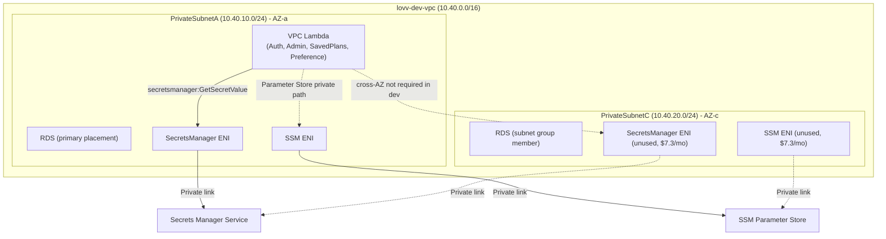
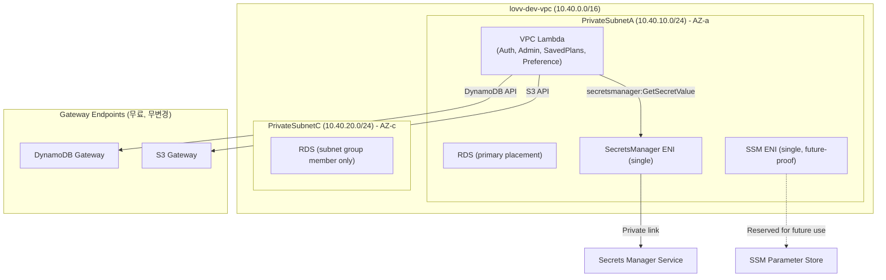

# Design Document: VPC Cost Optimization

## Overview

`lovv-dev-data-stack` CloudFormation 스택의 VPC Interface Endpoint 비용을 최적화한다. SSM과 Secrets Manager Interface VPC Endpoint를 각각 단일 AZ(PrivateSubnetA, 1 ENI)로 축소하여 월 약 $14.6를 절감하며, Lambda 기능과 RDS 보안 격리를 유지한다.

현재 상태:
- `SecretsManagerVpcEndpoint`: 템플릿과 배포 상태에 존재하며, 변경 전에는 PrivateSubnetA/C 2개 서브넷에 ENI를 배치했다.
- `SSMVpcEndpoint`: 템플릿과 배포 상태에 존재하며, 변경 전에는 PrivateSubnetA/C 2개 서브넷에 ENI를 배치했다.
- NAT 인스턴스: `EnableNatInstance=false` 적용 시 NAT EC2와 NAT 전용 SSM 파라미터가 삭제된다.

설계 목표:
1. `SSMVpcEndpoint`의 `SubnetIds`에서 `LovvPrivateSubnetC`를 제거하여 PrivateSubnetA 단일 AZ로 축소한다
2. `SecretsManagerVpcEndpoint`의 `SubnetIds`에서 `LovvPrivateSubnetC`를 제거하여 PrivateSubnetA 단일 AZ로 축소한다
3. Gateway Endpoint(S3, DynamoDB)는 변경하지 않는다
4. RDS 보안 격리를 유지한다
5. NAT 인스턴스 운영 가이드를 현재 배포 모델(`EnableNatInstance=true/false` 재배포)에 맞게 문서화한다

## Architecture

### 현재 아키텍처 (변경 전)



### 목표 아키텍처 (변경 후)



### 변경 요약

| 리소스 | 변경 전 | 변경 후 | 비용 영향 |
|--------|---------|---------|-----------|
| `SSMVpcEndpoint` | 2 AZ (PrivateSubnetA/C) | 1 AZ (PrivateSubnetA) | -$7.3/월 |
| `SecretsManagerVpcEndpoint` | 2 AZ (PrivateSubnetA/C) | 1 AZ (PrivateSubnetA) | -$7.3/월 |
| `DynamoDBGatewayEndpoint` | Gateway (무료) | 무변경 | $0 |
| `S3GatewayEndpoint` | Gateway (무료) | 무변경 | $0 |
| NAT Instance | enabled/running 가능 | `EnableNatInstance=false` 기본 및 필요 시 재배포 | -$3/월+ (비활성 시) |

> 실제 diff 기준: `infra/data-stack/template.yaml`의 기존 `SecretsManagerVpcEndpoint`와 `SSMVpcEndpoint`에서 각각 `LovvPrivateSubnetC`를 제거했다. 신규 endpoint 추가나 CloudFormation import 작업은 이 변경의 범위가 아니다.

## Components and Interfaces

### 1. CloudFormation 템플릿 변경 (`infra/data-stack/template.yaml`)

#### 1.1 Interface Endpoint SubnetIds 축소

```yaml
# Secrets Manager VPC Endpoint: VPC 내부 Lambda가 RDS secret 값을 private 경로로 조회한다.
SecretsManagerVpcEndpoint:
  Type: AWS::EC2::VPCEndpoint
  Properties:
    VpcId: !Ref LovvDevVPC
    ServiceName: !Sub com.amazonaws.${AWS::Region}.secretsmanager
    VpcEndpointType: Interface
    PrivateDnsEnabled: true
    SubnetIds:
      - !Ref LovvPrivateSubnetA
    SecurityGroupIds:
      - !Ref LovvEndpointSecurityGroup

# SSM VPC Endpoint: VPC 내부 Lambda가 Parameter Store 값을 private 경로로 조회한다.
SSMVpcEndpoint:
  Type: AWS::EC2::VPCEndpoint
  Properties:
    VpcId: !Ref LovvDevVPC
    ServiceName: !Sub com.amazonaws.${AWS::Region}.ssm
    VpcEndpointType: Interface
    PrivateDnsEnabled: true
    SubnetIds:
      - !Ref LovvPrivateSubnetA
    SecurityGroupIds:
      - !Ref LovvEndpointSecurityGroup
```

두 리소스는 모두 기존 logical ID를 유지한다. 변경은 `SubnetIds` 목록에서 `LovvPrivateSubnetC`를 제거하고 `LovvPrivateSubnetA`만 남기는 것으로 한정한다. `VpcId`, `ServiceName`, `VpcEndpointType`, `PrivateDnsEnabled`, `SecurityGroupIds`는 변경하지 않는다.

#### 1.2 Gateway Endpoint (무변경)

`DynamoDBGatewayEndpoint`와 `S3GatewayEndpoint`는 무료 Gateway endpoint이므로 변경하지 않는다.

### 2. README 업데이트 (`infra/data-stack/README.md`)

NAT 인스턴스 운영 가이드를 현재 배포 상태에 맞게 수정한다:

- `EnableNatInstance=false`이면 NAT EC2와 `/lovv/dev/network/nat_instance_id`가 존재하지 않음을 명시
- DB 작업 전 `EnableNatInstance=true`로 Data Stack을 재배포하는 절차
- 작업 완료 후 `EnableNatInstance=false`로 재배포해 NAT 리소스를 제거하는 절차
- Lambda가 NAT 인스턴스에 의존하지 않음을 명시

### 3. 테스트 코드 (`tests/test_data_stack_vpc_endpoints.py`)

새로운 테스트 파일을 작성하여 VPC Endpoint 단일 AZ 구성을 검증한다:

- `SSMVpcEndpoint` SubnetIds에 PrivateSubnetA만 포함 검증
- `SecretsManagerVpcEndpoint` SubnetIds에 PrivateSubnetA만 포함 검증
- Gateway Endpoint 무변경 검증
- RDS 보안 격리 유지 검증
- SAM Lambda VpcConfig가 Data Stack endpoint와 동일한 PrivateSubnetA를 사용함을 검증

### 4. 기존 테스트 업데이트 (`tests/test_data_stack_nat_instance.py`)

`test_existing_private_endpoint_and_rds_controls_remain` 테스트는 기존 endpoint logical ID와 Gateway Endpoint가 유지되는지 확인한다. 신규 리소스 추가가 아니라 기존 `SSMVpcEndpoint`/`SecretsManagerVpcEndpoint`의 subnet 목록 축소를 별도 테스트에서 검증한다.

## Data Models

이 기능은 데이터 모델 변경을 포함하지 않는다. 모든 변경은 CloudFormation 인프라 리소스 정의에 한정된다.

### 영향받는 리소스 속성

| 리소스 | 속성 | 값 |
|--------|------|-----|
| `SSMVpcEndpoint` | `SubnetIds` | `[!Ref LovvPrivateSubnetA]` |
| `SSMVpcEndpoint` | `PrivateDnsEnabled` | `true` |
| `SSMVpcEndpoint` | `SecurityGroupIds` | `[!Ref LovvEndpointSecurityGroup]` |
| `SecretsManagerVpcEndpoint` | `SubnetIds` | `[!Ref LovvPrivateSubnetA]` |
| `LovvDBSubnetGroup` | `SubnetIds` | `[SubnetA, SubnetC]` (무변경) |
| `LovvRDSInstance` | `PubliclyAccessible` | `false` (무변경) |

## Error Handling

### 배포 실패 시나리오

| 시나리오 | 영향 | 대응 |
|----------|------|------|
| Interface Endpoint subnet 수정 실패 | 스택 업데이트 롤백 | CloudFormation 자동 롤백으로 이전 상태 복원 |
| PrivateSubnetC ENI 삭제 실패 | 엔드포인트 업데이트 실패 | CloudFormation 이벤트와 EC2 VPC endpoint 상태를 확인 후 재시도 |
| NAT 재활성화 배포 실패 | DB 작업용 접속 경로 미생성 | `EnableNatInstance=true` 파라미터와 `CAPABILITY_IAM` 포함 여부를 확인 후 재배포 |

### 런타임 에러 처리

| 시나리오 | 현재 동작 | 변경 후 동작 |
|----------|-----------|-------------|
| SecretsManager Endpoint 불가 | Lambda 타임아웃 → HTTP 500 | 동일 (변경 없음) |
| SSM Endpoint 불가 | SSM Parameter Store 조회 실패 가능 | 동일 (변경 없음) |
| DynamoDB Gateway 불가 | Lambda DynamoDB 호출 실패 | 동일 (무변경) |

### CloudFormation Import

이번 변경은 기존 CloudFormation logical ID의 `SubnetIds` 수정이므로 import 전략을 사용하지 않는다.

## Testing Strategy

### 테스트 접근 방식

이 기능은 Infrastructure as Code(CloudFormation) 변경이므로, property-based testing은 적용하지 않는다. IaC는 선언적 설정이며 입력/출력이 있는 함수가 아니므로, 스냅샷/단언 기반 테스트와 배포 후 검증이 적합하다.

### 단위 테스트 (CloudFormation 템플릿 검증)

Python `unittest`를 사용하여 YAML 템플릿 내용을 문자열/파싱 기반으로 검증한다. 기존 `test_data_stack_nat_instance.py` 패턴을 따른다.

**테스트 파일: `tests/test_data_stack_vpc_endpoints.py`**

| 테스트 케이스 | 검증 내용 |
|--------------|-----------|
| `test_ssm_endpoint_single_az` | SSMVpcEndpoint SubnetIds에 LovvPrivateSubnetA만 포함 |
| `test_ssm_endpoint_private_dns_enabled` | SSMVpcEndpoint PrivateDnsEnabled: true |
| `test_ssm_endpoint_security_group` | SSMVpcEndpoint SecurityGroupIds에 LovvEndpointSecurityGroup 포함 |
| `test_secretsmanager_endpoint_single_az` | SecretsManagerVpcEndpoint SubnetIds에 LovvPrivateSubnetA만 포함 |
| `test_gateway_endpoints_unchanged` | DynamoDB/S3 Gateway Endpoint 속성 무변경 |
| `test_rds_security_isolation` | RDS PubliclyAccessible=false, DBSubnetGroup에 양쪽 서브넷 포함 |
| `test_rds_security_group_rules` | RDS SG 인바운드 규칙이 변경 전과 동일 |
| `test_private_route_no_igw` | Private route table에 IGW 직접 라우트 없음 |
| `test_lambda_subnet_alignment` | Lambda VpcConfig SubnetIds에 PrivateSubnetA 포함 검증 (SAM 템플릿 레벨) |

### 배포 후 수동 검증 체크리스트

1. `aws cloudformation describe-stacks --stack-name lovv-dev-data-stack` → `UPDATE_COMPLETE`
2. `aws ec2 describe-vpc-endpoints` → SSM/SecretsManager 엔드포인트 SubnetIds 확인
3. Lambda 호출 → SecretsManager GetSecretValue 성공 확인
4. `aws cloudformation create-change-set` → Gateway Endpoint에 변경 action 없음 확인
5. CloudFormation changeset에서 DynamoDB/S3 Gateway Endpoint가 `Modify/Remove/Replace`에 포함되지 않음 확인

### 테스트 실행 방법

```bash
python -m pytest tests/test_data_stack_vpc_endpoints.py -v
python -m pytest tests/test_data_stack_nat_instance.py -v
```

### PBT 미적용 사유

Property-based testing은 다음 이유로 이 기능에 적합하지 않다:

- 변경 대상이 CloudFormation IaC 선언적 설정이다 (입력/출력 함수가 아님)
- 테스트 대상은 YAML 파일의 정적 구조이다
- 입력 공간이 고정되어 있으며 무작위 입력으로 검증할 로직이 없다
- 스냅샷/단언 기반 테스트와 배포 검증이 IaC에 더 적합하다
