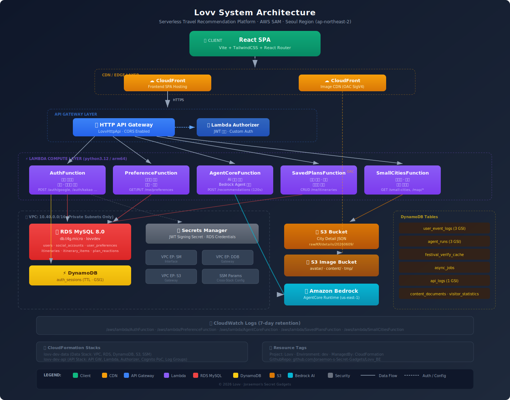

# Lovv Backend

Lovv 여행 추천 서비스의 AWS SAM 기반 서버리스 백엔드입니다. 소셜 로그인과
세션, 사용자 선호도, 소도시 데이터, AgentCore V2 일정 추천, Kakao Mobility
경로 계산, 일정 저장 및 관리자 운영 API를 제공합니다.

## 기술 스택

- Python 3.12, AWS SAM, AWS Lambda (arm64)
- Amazon API Gateway HTTP API
- Amazon Aurora MySQL: 사용자, 선호도, 저장 일정, 관리자 운영 데이터
- Amazon DynamoDB: refresh session 및 관리자 권한 캐시 TTL
- Amazon S3/DynamoDB: 소도시 원천 데이터와 조회 인덱스
- Amazon Bedrock AgentCore Runtime V2: 일정 생성 및 수정
- Kakao Mobility Directions API: 일정 동선, 구간 거리 및 시간 계산
- AWS Secrets Manager와 Systems Manager Parameter Store: 런타임 비밀값

## 시스템 구성



```text
Web Client
   |
   v
API Gateway HTTP API
   |
   +-- Auth Lambda ---------- DynamoDB sessions / Aurora MySQL
   +-- Preferences Lambda --- Aurora MySQL
   +-- AgentCore Lambda ----- Bedrock AgentCore V2 / Kakao Mobility
   +-- Saved Plans Lambda --- Aurora MySQL
   +-- Small Cities Lambda -- S3 / DynamoDB / image CDN
   +-- Admin Lambda --------- Aurora MySQL / DynamoDB authz cache
```

세부 인증 흐름과 데이터 모델은 다음 문서를 참고합니다.

- [인증 흐름](docs/architecture/lovv-auth-flow.svg)
- [데이터 모델](docs/architecture/lovv-data-model.svg)
- [관리자 RBAC 명세](docs/specs/ADMIN_RBAC_SPEC.md)
- [관리자 운영 Runbook](docs/specs/ADMIN_OPERATIONS_RUNBOOK.md)

## 주요 API

아래 경로는 `template.yaml`에 선언된 HTTP API 기준입니다. 별도 표기가 없는
사용자 및 관리자 API는 `Authorization: Bearer <access-token>` 인증이 필요합니다.

### 인증과 사용자

| Method | Path | 설명 |
| --- | --- | --- |
| `POST` | `/api/v1/auth/google` | Google 로그인 |
| `POST` | `/api/v1/auth/kakao` | Kakao 로그인 |
| `POST` | `/api/v1/auth/cognito/session` | Cognito JWT를 Lovv 세션으로 연결 |
| `GET` | `/api/v1/auth/session` | HttpOnly refresh cookie로 세션 갱신 |
| `POST` | `/api/v1/auth/logout` | refresh session 종료 |
| `GET` | `/api/v1/auth/me` | 현재 사용자 조회 |
| `PATCH` | `/api/v1/auth/me` | 현재 사용자 프로필 수정 |
| `GET` | `/api/v1/auth/social-accounts` | 연결된 소셜 계정 조회 |
| `POST` | `/api/v1/auth/link/{provider}` | Google 또는 Kakao 계정 연결 |

### 선호도, 추천과 경로

| Method | Path | 설명 |
| --- | --- | --- |
| `GET` | `/api/v1/me/preferences` | 사용자 여행 선호도 조회 |
| `PUT` | `/api/v1/me/preferences` | 사용자 여행 선호도 저장 |
| `POST` | `/api/v1/recommendations` | AgentCore V2 일정 생성·명확화·수정 |
| `POST` | `/api/v1/routes` | 좌표 배열의 Kakao Mobility 경로 재계산 |
| `GET` | `/api/v1/recommendations/monthly-cities` | 월간 추천 도시 조회 (공개) |
| `GET` | `/api/v1/recommendations/popular-destinations` | 인기 여행지 조회 (공개) |
| `GET` | `/api/v1/recommendations/reaction-cities` | 사용자 반응 기반 도시 조회 |

`POST /api/v1/routes`는 서버에서 Kakao Mobility 키를 읽으며, 클라이언트에 키를
노출하지 않습니다. 응답의 `route.segments`에는 카드 간 거리와 시간이 포함됩니다.

### 저장 일정

| Method | Path | 설명 |
| --- | --- | --- |
| `POST` | `/api/v1/me/itineraries` | 일정 저장 |
| `GET` | `/api/v1/me/itineraries` | 내 일정 목록 조회 |
| `GET` | `/api/v1/me/itineraries/{itineraryId}` | 내 일정 상세 조회 |
| `DELETE` | `/api/v1/me/itineraries/{itineraryId}` | 일정 삭제 |
| `PUT` | `/api/v1/me/itineraries/{itineraryId}/reactions/like` | 좋아요 등록 |
| `DELETE` | `/api/v1/me/itineraries/{itineraryId}/reactions/like` | 좋아요 취소 |
| `PATCH` | `/api/v1/me/itineraries/{itineraryId}/share` | 공개 상태 변경 |
| `POST` | `/api/v1/me/itineraries/{itineraryId}/clone` | 공개 일정 복제 |
| `GET` | `/api/v1/itineraries/public` | 공개 일정 목록 조회 |
| `GET` | `/api/v1/itineraries/{itineraryId}` | 공개 일정 상세 조회 |

### 소도시와 이미지

| Method | Path | 설명 |
| --- | --- | --- |
| `GET` | `/api/v1/small-cities` | 소도시 목록 조회 |
| `GET` | `/api/v1/small-cities/{cityId}` | 소도시 상세 조회 |
| `GET` | `/api/v1/small-cities/{cityId}/places` | 도시 명소와 축제 조회 |
| `GET` | `/api/v1/map/cities` | 지도용 도시 목록 조회 |
| `GET` | `/api/v1/map/cities/{cityId}` | 지도용 도시 상세 조회 |
| `GET` | `/api/v1/map/cities/{cityId}/places` | 지도용 장소 조회 |
| `GET` | `/api/v1/map/markers` | 지도 마커 조회 |
| `GET` | `/api/v1/kakao-places/{placeId}/image` | Kakao 장소 대표 이미지 조회 |

`/api/small-cities` 비버전 경로도 기존 클라이언트 호환을 위해 유지됩니다.

### 관리자

관리자 API는 `/api/v1/admin/*` 아래에 있으며 사용자 관리, 데이터 제안 검토,
월간 여행지 게시, 운영 지표, 공지, 추천 정책, 감사 로그와 게시 작업을 다룹니다.
일반 관리자 조회는 role 인증을 사용하고, 고위험 승인·거절은 최근 MFA 검증과
다른 `R-SUPER-ADMIN`의 승인을 요구합니다.

## 저장소 구조

```text
Lovv_BE/
├── docs/                       # 아키텍처, 로컬 DB, 운영 명세
├── events/                     # SAM local invoke 예제 이벤트
├── infra/data-stack/           # VPC, RDS, DynamoDB 데이터 스택
├── parameters/                 # dev/poc/prod SAM 파라미터
├── schema/aurora_mysql/        # 관리자 및 일정 스냅샷 migration
├── scripts/                    # DB, 관리자, 로컬 smoke 도구
├── src/
│   ├── admin/                  # 관리자 운영, MFA, 고위험 승인
│   ├── agentcore/              # AgentCore V2 프록시와 Kakao 경로 계산
│   ├── auth/                   # 로그인, 세션, Lambda authorizer
│   ├── kakao_places/           # Kakao 장소 이미지 resolver
│   ├── preferences/            # 사용자 선호도
│   ├── recommendations/        # 월간·인기·반응 추천 피드
│   ├── saved_plans/            # 일정 저장, 공유, 복제, 반응
│   ├── shared/                 # HTTP, 인증, DB, 로깅 공통 코드
│   └── small_cities/           # S3/DynamoDB 소도시 조회
├── tests/                      # unittest 테스트
├── template.yaml               # Backend API SAM 템플릿
├── samconfig.toml              # 환경별 배포 프로필
└── docker-compose.yml          # 로컬 MySQL 8
```

## 개발 환경 준비

### 요구 사항

- Python 3.12
- AWS SAM CLI
- Docker와 Docker Compose (로컬 MySQL 사용 시)
- AWS CLI와 배포 권한 (AWS 배포 시)

### 의존성 설치

```bash
python3.12 -m venv .venv
source .venv/bin/activate
python -m pip install --upgrade pip
python -m pip install -r src/requirements.txt -r requirements-dev.txt
```

Windows PowerShell에서는 `.venv\Scripts\Activate.ps1`로 가상환경을 활성화합니다.

`.env.example`은 변수 구조만 제공하는 예시입니다. 실제 API 키, JWT 서명값,
OAuth secret 또는 AWS 자격증명을 Git에 커밋하지 마세요.

## 로컬 실행

### 단위 테스트

```bash
PYTHONPATH=src python -m unittest discover -s tests
```

PowerShell:

```powershell
$env:PYTHONPATH = "src"
python -m unittest discover -s tests
```

외부 서비스와 DB는 대부분 테스트 double로 대체됩니다. 실DB 테스트는 기본적으로
skip되며, 명시적인 integration 환경 변수 없이 실DB 검증으로 간주하지 않습니다.

### 로컬 MySQL

```bash
docker compose up -d
docker compose exec mysql mysql -uroot -plovvlocal -e "USE lovvdev; SHOW TABLES;"
```

기본 접속 주소는 `127.0.0.1:13306`, DB는 `lovvdev`입니다. 초기 스키마와 관리자
migration은 빈 볼륨의 최초 기동 시 순서대로 적용됩니다. 자세한 절차는
[로컬 DB 가이드](docs/LOCAL_DB_DOCKER.md)를 참고하세요.

### SAM 로컬 검증

```bash
sam validate --lint --template-file template.yaml
sam build
sam local invoke AuthFunction --event events/auth-me.json
```

Lambda authorizer, VPC, AWS 관리형 서비스와 외부 API까지 포함한 동작은 로컬 SAM만으로
완전히 재현되지 않습니다. 인증 흐름은 단위 테스트와 배포 환경 smoke test를 함께
사용합니다.

## 환경 설정

배포 파라미터는 다음 파일에서 관리합니다.

| 환경 | SAM config | Parameter file | Stack name |
| --- | --- | --- | --- |
| dev | `default` | `parameters/dev.yaml` | `lovv-dev-api` |
| poc | `poc` | `parameters/poc.yaml` | `lovv-poc-api` |
| prod | `prod` | `parameters/prod.yaml` | `lovv-prod-api` |

중요한 런타임 설정:

- `AgentCoreRuntimeArn`: AgentCore V2 Runtime ARN
- `KakaoMobilityRestApiKeySsmName`: Kakao Mobility 키가 저장된 SSM SecureString 이름
- `AuthTokenSigningSecretArn`: JWT 서명 secret의 Secrets Manager ARN
- `AllowedCorsOrigin`: credential 요청을 허용할 정확한 브라우저 origin 목록
- `RdsHost`, `RdsSecretArn`, `VpcId`, `PrivateSubnetA`, `PrivateSubnetC`: 데이터 스택 연결
- `MapCityS3Bucket`, `MapCityS3Prefix`, `MapCityDynamoTableName`: 소도시 데이터 소스

배포 전에 대상 계정과 리전에 Secrets Manager secret 및 SSM SecureString이 실제로
존재해야 합니다. `poc/prod` 파라미터 파일의 placeholder 인프라 값도 반드시 실제
리소스로 교체해야 합니다.

## 배포

먼저 로컬 검증을 수행합니다.

```bash
PYTHONPATH=src python -m unittest discover -s tests
sam validate --lint --template-file template.yaml
sam build
```

환경별 배포:

```bash
# dev
sam deploy --config-env default

# poc
sam deploy --config-env poc

# prod
sam deploy --config-env prod
```

`prod` 배포 전에는 CloudFormation changeset, CORS origin, OAuth callback URL, cookie
domain, IAM 범위, RDS 대상과 secret 경로를 반드시 검토합니다. 배포 결과의 API URL은
CloudFormation output `LovvApiUrl`에서 확인할 수 있습니다.

## 보안 원칙

- 브라우저에는 access token만 Bearer 헤더로 전달하고 refresh token은 HttpOnly cookie로 관리합니다.
- refresh token 원문은 저장하지 않고 DynamoDB에 해시와 TTL만 보관합니다.
- Kakao Mobility, OAuth, JWT 및 DB secret은 클라이언트 코드나 Git에 넣지 않습니다.
- API Gateway CORS는 `AllowedCorsOrigin`에 등록된 정확한 origin만 허용합니다.
- 추천 및 경로 API는 Lambda Function URL이 아닌 인증된 HTTP API 경로를 사용합니다.
- 관리자 고위험 작업은 역할 검사, MFA, 본인 승인 금지와 감사 로그를 적용합니다.

## 검증 체크리스트

```bash
git diff --check
PYTHONPATH=src python -m unittest discover -s tests
sam validate --lint --template-file template.yaml
sam build
```

실제 AWS 또는 외부 제공자 smoke test를 수행하지 않았다면 테스트 결과에 그 사실을
명시해야 합니다.
